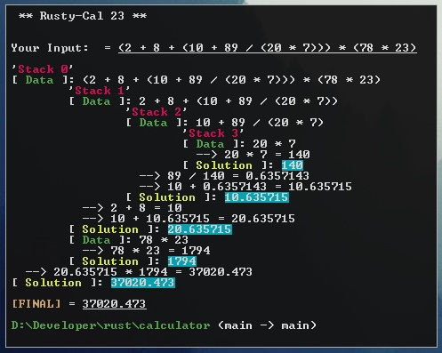

## [A Scientific and Programmer Calculator] - Command Line w/ Rust :)

**What it does:**
1. *enter a string of math operations into the command line*
2. *operations are ordered and shown using data created from recursion*
3. *colorful output and formatting showing steps*

**How to use:**
1. *install rust and cargo (https://www.rust-lang.org/tools/install)*
2. *clone the repo*
3. *navigate to the repo* 
4. *run `cargo run`*

**TODO:**
1. *choose between scientific and programmer mode*
2. *loading fx*
3. *file input for multiple calculations*
4. *fix ugly user input*

**Flexibility:**
1. *operations must be in correct mathematical format obviously*
2. *any amount of white space allowed*
3. *supports negative numbers side by side with subtraction (multiple negations possible)*
4. *multiple un-needed paranthesis (such as (((4+1))))*
5. *re-enter calculations and quit when you want*
